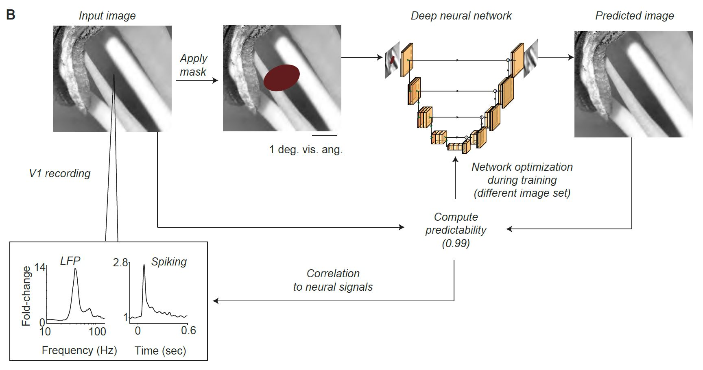

# U-Net-Pred



The neural network architecture was based on the U-Net ar-chitecture (Falk et al., 2019; Ronneberger et al., 2015), with thefollowing modifications:  For initialization, the encoder part ofU-Net was replaced by all the convolutional and pooling lay-ers of the VGG-16 network,  using the Keras implementation(Simonyan and Zisserman, 2014; Chollet et al., 2015).  Trans-fer learning using VGG-16 has been previously used in imagesegmentation (Iglovikov and Shvets, 2018), image reconstruc-tion (Uhrig et al., 2017), style transfer (Gatys et al., 2015), andimage inpainting (Liu et al., 2018).  The resulting network ar-chitecture consisted of five blocks, each of which had two orthree convolutional layers (3×3) with ReLU (rectified linear)activation functions, followed by a max-pooling (2×2) opera-tion. The decoder consisted of five blocks, each with a nearest-neighbor upsampling layer (2×2), followed by two convolu-tional layers.  The output layer was a convolutional layer with,as is conventional, a linear activation function.Partial Convolution.  All convolution operations in the net-work,  including  the  VGG-16  network,  were  implemented  aspartial convolutions.   Partial convolution has been introducedwith the sparsity-invariant convolutional network where the in-put to each convolution is paired with a binary mask indicat-ing which pixels are observable or missing, respectively (Uhriget al., 2017). Partial observability of the inputs during the train-ing makes the network robust to input sparsity, regardless of thetask of the network.  We implemented a modified version withmask updates per network operation, as described in (Liu et al., 2018). The idea of partial convolution is that the missing regionis gradually filled, and that the filled-in information is used forfilling in the rest of the missing pixels in an iterative way.

For more details, please see the methods part of our paper:


[Predictability in natural images determines V1 firing rates and synchronization: A deep neural network approach](https://www.biorxiv.org/content/10.1101/2020.08.10.242958v1) 


# Installation

Clone/Fork the repository to use the scripts.

```shell
git clone https://github.com/uranc/gamma-net.git
```

## Requirements
tensorflow v1.14, keras-contrib
```shell
pip install tensorflow==1.14
pip install git+https://www.github.com/keras-team/keras-contrib.git
```

# Usage

## Command-Line

You can use pre-trained model based on VGG-16 to predict gamma peak value in log10 space. Rquires the input data a numpy array.
```shell
python pred.py --mode predict --model a3
```

Input size

Requires TFRecords as an input file

```shell
python pred.py --mode train --model save_name
```


## Jupyter notebook
