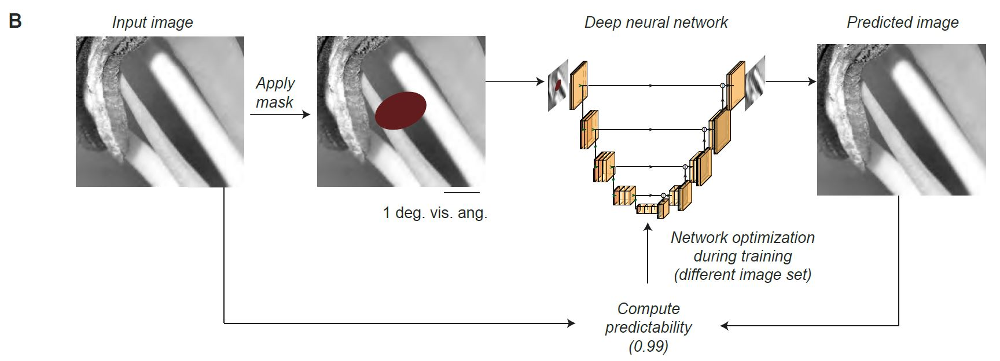

# U-Net-Pred



The neural network architecture was based on the U-Net architecture (Falk et al., 2019; Ronneberger et al., 2015), with the following modifications:  For initialization, the encoder part of U-Net was replaced by all the convolutional and pooling layers of the VGG-16 network,  using the Keras implementation (Simonyan and Zisserman, 2014; Chollet et al., 2015).  Transfer learning using VGG-16 has been previously used in image segmentation (Iglovikov and Shvets, 2018), image reconstruction (Uhrig et al., 2017), style transfer (Gatys et al., 2015), and image inpainting (Liu et al., 2018).  The resulting network architecture consisted of five blocks, each of which had two or three convolutional layers (3×3) with ReLU (rectified linear) activation functions, followed by a max-pooling (2×2) operation. The decoder consisted of five blocks, each with a nearest-neighbor upsampling layer (2×2), followed by two convolutional layers.  The output layer was a convolutional layer with, as is conventional, a linear activation function.  
All convolution operations in the network,  including  the  VGG-16  network,  were  implemented  as partial convolutions. Partial convolution has been introduced with the sparsity-invariant convolutional network where the input to each convolution is paired with a binary mask indicating which pixels are observable or missing, respectively (Uhriget al., 2017). Partial observability of the inputs during the training makes the network robust to input sparsity, regardless of the task of the network.  We implemented a modified version with mask updates per network operation, as described in (Liu et al., 2018). The idea of partial convolution is that the missing region is gradually filled, and that the filled-in information is used for filling in the rest of the missing pixels in an iterative way.

For more details, please see the methods part of our paper:


[Predictability in natural images determines V1 firing rates and synchronization: A deep neural network approach](https://www.biorxiv.org/content/10.1101/2020.08.10.242958v1) 


# Installation

Clone/Fork the repository to use the scripts.

```shell
git clone https://github.com/uranc/U-Net-Pred.git
```

## Requirements
tensorflow v1.14, keras v2.2.4, h5py v2.9.0 ( < v3.x should suffice), scikit-image==0.17.2, (optional: other versions should also work).

Assuming conda:
```shell
conda create --name gammanet python=3.6 
pip install tensorflow==1.14
pip install keras==2.2.4
pip install scikit-image==0.17.2
pip install --ignore-installed h5py==2.9.0
```

# Usage

## Command-Line

You can use the pre-trained model based on VGG-16 to get a predictability measure.

Input size is originally 224x224x3 and training set consisted of Black & White and color images. Input can either be:
  - A single image file (224x224x3) - see skimage.io.imread for details
  - A 4D numpy array ( num_images x 224x224x3)

As the network is fully convolutional other image sizes should work fine - as long as it is larger than 84x84.

```shell
python pred.py --input examples/sample_im.png
```  
Output will be printed on the command line. 

```shell
python pred.py --input examples/samples_nat_im.npy
```
Output will be saved to examples/samples_nat_im_pred.npy
  


## Jupyter notebook
Please check our notebook on how to use or modify the usage of the model: [samples_nat_im_demo.ipynb](https://github.com/uranc/gamma-net/blob/master/sample_nat_im_demo.ipynb).
  
## New Features  
  - directory of images
  - tensorflow v2
  
  

